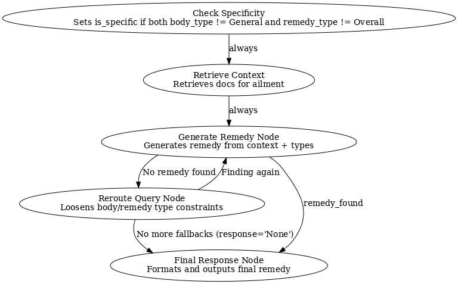
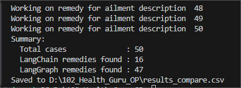
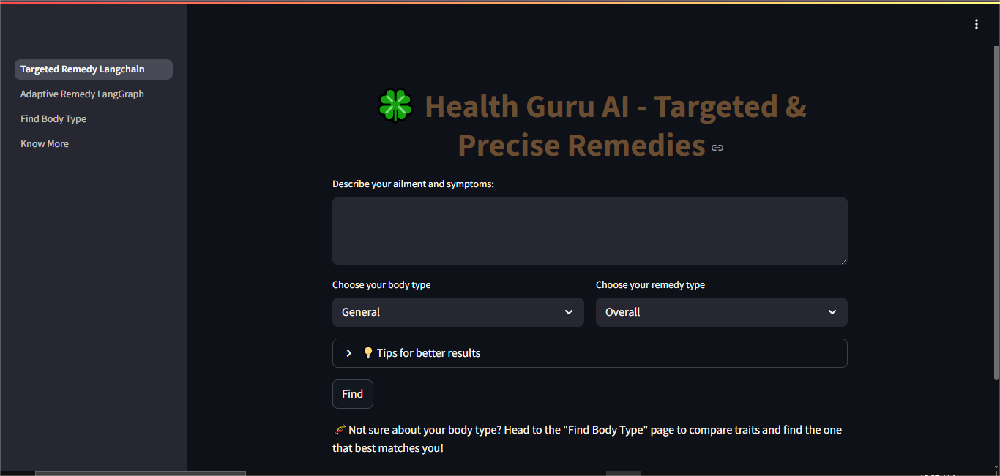
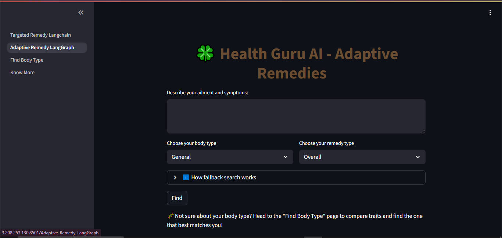
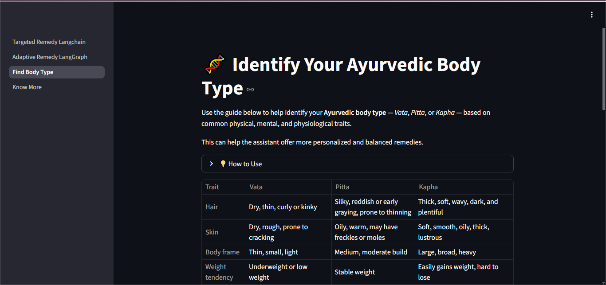
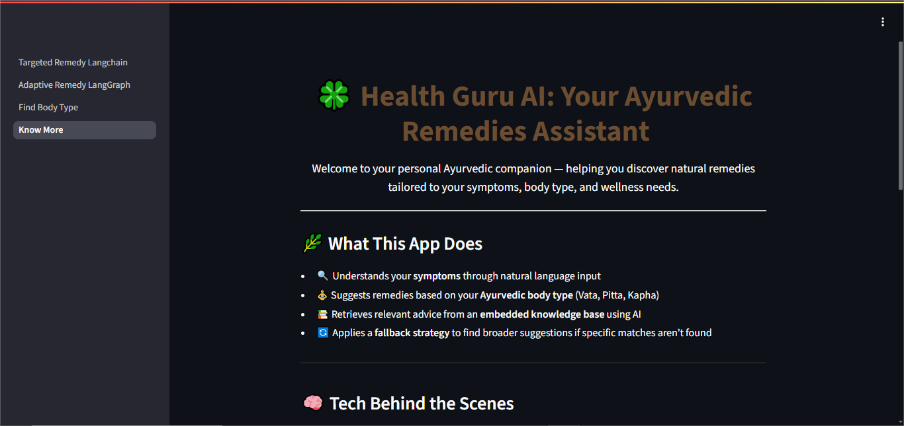

# 🍀 Health Guru AI — Ayurvedic Remedies Assistant

**Live Demo:** [healthguru.live](http://3.208.253.130:8501/)  
**Video:** [YouTube link]  
**Tech Stack:** Streamlit • LangChain • LangGraph • FAISS • OpenAI

Health Guru AI is a dual-mode Ayurvedic remedy assistant that combines **LangChain-powered targeted search** with **LangGraph-powered adaptive retrieval**.  
Users enter their symptoms, Ayurvedic body type, and preferred remedy type.  
If no precise match is found, the adaptive flow intelligently broadens the search to maximize retrieval success — achieving up to **94% remedy recall** in evaluation tests.

---

## ✨ Features
- 🎯 **Targeted Remedy Search** — LangChain + FAISS for precise matches.  
- 🔄 **Adaptive Remedy Mode** — LangGraph fallback strategy.  
- 🧩 **Body Type–Specific Filtering** — Pitta, Vata, Kapha, General.  
- 🧪 **Remedy Categories** — Herbal/Ayurvedic medications, Dietary/Nutritional Changes, Yoga Postures/Exercise, Cleansing Procedures, Breathing Exercises, Overall.  
- 📂 **Persistent Vector Database** — Fast semantic search.  
- 💡 **User Guidance** — Suggests adaptive mode if targeted fails.

---

## 🏗 Architecture
**Core Components:**
1. **Data Processing** — PDF loading, CID fix, text chunking, embedding with OpenAI.  
2. **Vector Store** — FAISS local semantic search.  
3. **Targeted Search Flow** — LangChain direct retrieval.  
4. **Adaptive Flow** — LangGraph fallback to broader criteria.  
5. **UI** — Streamlit multi-page app.

See [TECHNICAL_DETAILS.md](TECHNICAL_DETAILS.md) for full implementation details.

---
### LangGraph Flow Diagram

----
## 📄 Application Pages
1. **Targeted Remedy (LangChain)** — precise search with strict filters for body type & remedy type.  
2. **Adaptive Remedy (LangGraph)** — uses fallback search logic to broaden scope if no exact match.  
3. **Find Body Type** — interactive static trait table to help identify Ayurvedic body types.  
4. **Know More** — introduction, usage guide, and tech stack overview.

---

## 📊 Evaluation
| Metric                   | Value          | Notes                                   |
|--------------------------|---------------:|-----------------------------------------|
| Cases evaluated          | 50             | scripts/evaluate_compare.py             |
| LangChain remedies found | **16**         | Baseline chain flow                     |
| LangGraph remedies found | **47**         | Improved graph orchestration            |
| Run date                 | **August 13, 2025** | model=gpt-4o-mini, temp=0, k=12      |

**Takeaway:** LangGraph achieved a **94% success rate (62 percentage points improvement)** over baseline LangChain.

[📄 Full Evaluation Results (CSV)](results_compare.csv) 

---

## 🖼 Screenshots

**1️⃣ Targeted Remedy (LangChain)**  
  

**2️⃣ Adaptive Remedy (LangGraph)**  
  

**3️⃣ Find Body Type**  
  

**4️⃣ Know More / Introduction**  
  
 

---

## ⚠ Limitations
- Dataset-limited; may not cover all real-world remedies.  
- No automated body type detection.

---

## 📅 Roadmap
- Expand Ayurvedic knowledge base.  
- Introduce user-controlled fallback preferences.

---

## 🔒 Security
- `.env` is in `.gitignore`.  
- No API keys committed.  
- FAISS loaded only with trusted data.

---

## 📜 Technical Details
See [TECHNICAL_DETAILS.md](TECHNICAL_DETAILS.md) for:
- Ingestion pipeline (PDFPlumber, CID mapping).  
- Chunking & embeddings configuration.  
- Retrieval logic & prompt orchestration.  
- Model configurations.  
- Evaluation setup.
